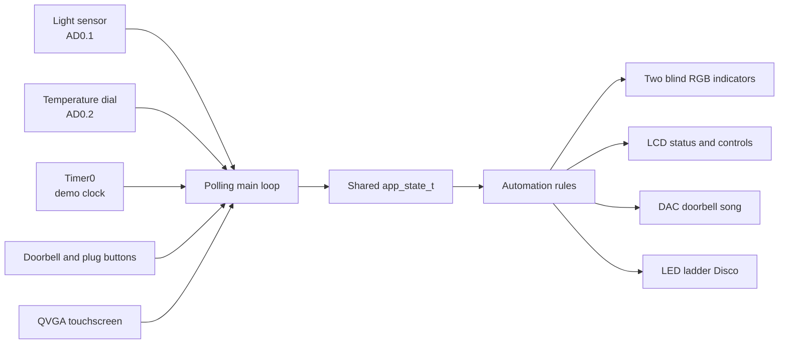

# DESN2000_T11D_A
The code implementation of DESN2000 T11D A project.
Coded modules: 
- Disco mode
- Morning Routine
  - Expresso Machine
  - Doorbell
- Evening Routine
  - Doorbell
  - Light Sensors
  - Do not disturb
- Temperature display

Files: 
```
                                                               main.c
                                                                 |
                -----------------------------------------------------------------------------------------
                |                 |                   |                 |                 |             |    
SEGEMENTS:   morning           evening             disco/            heater/           display    do_not_disturb
             routine           routine             doorbell          cooler
                 |                 |                    |                |                 |             |
What should  -coffee           -idle mode         -music/leds         -leds          -QVGA display     -leds
change?      -blind operation  -blind operation   
                 |                      |              |                |                 |              |
INPUT:     light sensor           light sensor      button            dial               dial       light sensor
                                                                                       SEGMENTS
 
HELPER: 
- LED operation
- blind operation

```

# DESN2000 T11D A — Smart Cottage Hub

This project is a local, wired smart-home prototype for a holiday cottage. It runs on an **LPC2478 / ARM7TDMI-S** with a QVGA touchscreen and Daughter Board.

The system uses time, ambient light and user input to simulate:

- two automated blinds;
- an espresso-machine smart plug;
- house-light status;
- heating/cooling status;
- a doorbell song with an LED Disco effect; and
- Do Not Disturb with a missed-guest counter.

No real 240 V appliance is controlled. The project uses LEDs, the LCD and other low-voltage board outputs as safe simulations.

## Current status

- The integrated Keil project builds and links with **0 errors and 0 warnings**.
- Output image: `output/desn2000_t11d_a.axf`.
- The standalone AD0.1 light-sensor path has been tested successfully in NyanSim.
- Full physical-board testing is still required for the touchscreen, TEMT6000 calibration, buttons, RGB LEDs and LCD recovery after Disco mode.

Build success proves that the source compiles and links. It does not prove that every hardware feature has passed a board test.

## System overview



The application uses a single-threaded **polling superloop**. There is no RTOS, dynamic memory or application interrupt system. All current values and output states are stored in one `app_state_t` structure.

## Main control loop

Each loop performs the following steps:

1. Read Timer0 and calculate the accelerated demonstration time.
2. Read the light sensor and temperature dial through ADC0.
3. Apply the time, light and temperature rules.
4. Check the smart-plug and doorbell buttons.
5. Read one touchscreen command.
6. Update the blind RGB outputs.
7. Refresh the LCD every 250 ms.

Manual controls have priority over automatic rules. `AUTO RESET` clears the manual overrides and recalculates the outputs using the current time and sensor readings.

## Automation rules

The demonstration starts at **05:30**. One real second advances the clock by one demonstration hour. The first update therefore changes the display from 05:30 to 06:30.

| Demonstration time | Routine | Smart plug | Blinds | House lights |
|---|---|---|---|---|
| 00:00–05:59 | Night | Off | Down | On |
| 06:00–11:59 | Morning | On | Controlled by light | Off |
| 12:00–17:59 | Day | Off | Controlled by light | Off |
| 18:00–21:59 | Evening | Off | Down | On |
| 22:00–23:59 | Night | Off | Down | On |

### Light control

The light sensor produces a 10-bit ADC value from 0 to 1023.

| Raw ADC value | Light level | Automatic blind state | RGB colour |
|---:|---|---|---|
| 0–300 | Dark | Up | Red |
| 301–699 | Medium | Mid-way | Green |
| 700–1023 | Bright | Down | Blue |

The `300` and `700` thresholds are demonstration values. They are not calibrated lux measurements.

During Evening and Night, the time rule closes both blinds regardless of the light reading.

### Heating and cooling display

The onboard potentiometer represents a simulated room temperature from **16 °C to 30 °C**. The target is 22 °C with a 1 °C deadband.

| Simulated temperature | LCD state |
|---:|---|
| 16–20 °C | Heating |
| 21–23 °C | Comfortable |
| 24–30 °C | Cooling |

This is an LCD demonstration only. There is no real temperature sensor, heater or cooler actuator.

## User controls

| Input | Action |
|---|---|
| P0.10 / S1 | Doorbell |
| P0.11 / S2 | Toggle smart plug and enter manual mode |
| Touch `PLUG` | Toggle smart plug and enter manual mode |
| Touch `BLIND` | Cycle both blinds through Up, Mid-way and Down |
| Touch `DND` | Toggle Do Not Disturb |
| Touch `AUTO RESET` | Clear overrides, DND and event counters, then return to automatic control |

When DND is off, a doorbell press plays the song and LED pattern. When DND is on, the song and LEDs are suppressed and the missed-guest counter increases.

The touchscreen only generates one command per press. The user must release the screen before the same control can be triggered again.

The `LIGHT TEST` button only changes the light value when `LIGHT_SENSOR_SIMULATION` is set to `1`. The current build uses the real AD0.1 path, so the button has no effect; use the NyanSim light control or a physical light source instead.

## Important hardware mapping

| Pin/resource | Use |
|---|---|
| P0.10 | Doorbell button |
| P0.11 | Smart-plug override button |
| P0.24 / AD0.1 | TEMT6000 light-sensor input |
| P0.25 / AD0.2 | Potentiometer used as simulated temperature |
| P0.26 / AOUT | DAC speaker output |
| P0.22 | Active-high LED-ladder enable |
| P2.1–P2.8 | LCD interface and temporary Disco LED-ladder output |
| P3.16–P3.18 | Blind 1 RGB: red=up, green=mid-way, blue=down |
| P3.19–P3.21 | Blind 2 RGB: red=up, green=mid-way, blue=down |
| SPI0 / P0.20 CS | TSC2046 touchscreen |
| External SDRAM | LCD framebuffer at `0xA0000000` |

For a physical TEMT6000 test, connect the sensor circuit to 3.3 V, P0.24/AD0.1 and ground through the supplied 10 kΩ arrangement. Disconnect the J12 accelerometer-Y route from P0.24 first.

The temperature dial uses P0.25/AD0.2. Confirm that J11 selects the potentiometer and that J12 does not also connect the accelerometer-X signal.

## Key technical details

### ADC

- ADC0 is read by polling; ADC interrupts are disabled.
- AD0.1 reads the light sensor.
- AD0.2 reads the temperature dial.
- Each conversion has a polling timeout and returns the previous valid value if the conversion does not finish.

### Timer and audio

- CPU clock: 72 MHz.
- Peripheral clock: 36 MHz.
- Timer0 is configured as a free-running 1 µs counter.
- The demo clock, button lockout and DAC timing share Timer0.
- Both physical buttons use rising-edge detection with a 100 ms lockout.
- Audio is produced as a square wave through the P0.26 DAC.

### LCD and touchscreen

- Display size: 240 × 320 pixels.
- Colour format: 16-bit RGB565.
- The framebuffer is stored in external SDRAM.
- The project uses the 16-bit SDRAM path so that P3.16–P3.21 remain available for the blind RGB outputs.
- The TSC2046 touchscreen is read by polling SPI0.
- Touch orientation and pressure thresholds still require physical-board calibration.

### Doorbell Disco

The doorbell plays the first 58 notes of the Lab 5 Nyan Cat data. Its nominal audio duration is approximately **3.33 seconds**.

P2.1–P2.8 are shared by the LCD interface and the Daughter Board LED ladder. Disco mode therefore:

1. saves the LCD pin and controller configuration;
2. stops the LCD controller;
3. changes P2.1–P2.8 to GPIO;
4. plays the song and 16-step LED pattern;
5. disables and clears the LED ladder;
6. restores the LCD configuration;
7. reinitialises the LCD panel and redraws the screen; and
8. returns SPI0 to touchscreen mode.

The full event, including LCD recovery, blocks the main polling loop for about four seconds.

## Project structure

| Path | Purpose |
|---|---|
| [`src/main.c`](src/main.c) | Initialisation and main polling loop |
| [`src/app_state.h`](src/app_state.h) | Shared application state and enums |
| [`src/app_logic.c`](src/app_logic.c) | Automation and override rules |
| [`src/config.h`](src/config.h) | Thresholds, timing and touch settings |
| [`src/inputs/`](src/inputs/) | ADC, buttons and touchscreen drivers |
| [`src/helper/`](src/helper/) | Timer0, DAC audio and blind RGB control |
| [`src/active_house_operations/`](src/active_house_operations/) | Display, routines, DND, HVAC and Disco |
| [`src/lcd/`](src/lcd/) | Reused Lab 6 LCD, graphics and SDRAM support |
| [`evidence/`](evidence/) | Build and test records |
| [`light_sensor_step_test/`](light_sensor_step_test/) | Standalone NyanSim AD0.1 test project |

## Lab code used

- **Lab 1:** ADC register sequence, adapted to bounded polling.
- **Lab 4:** GPIO button polling, edge detection and RGB outputs.
- **Lab 5:** Timer/DAC tone generation and Nyan Cat song data.
- **Lab 6:** LPC2478 startup, LCD, SDRAM, graphics and SPI touchscreen patterns.
